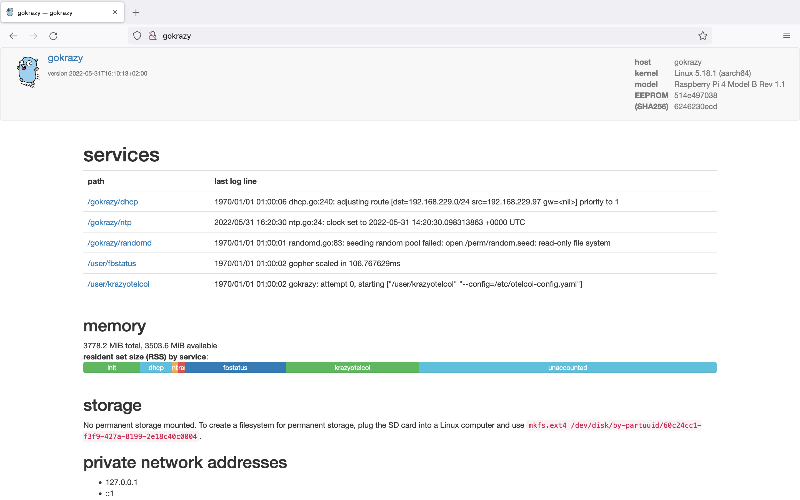
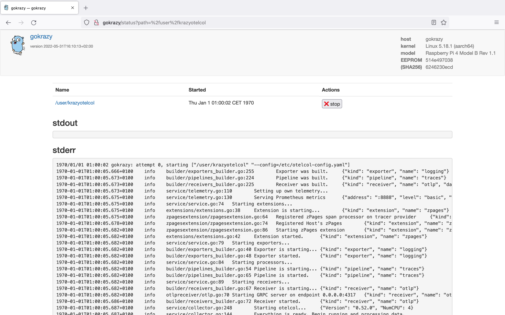

# GoKrazy Appliance of the OpenTelemetry Collector

Run the [OpenTelemetry collector](https://github.com/open-telemetry/opentelemetry-collector) as an appliance on a Raspberry Pi (powered by [gokrazy](https://gokrazy.org/)).

## Motivation

The motivation behind [gokrazy](https://gokrazy.org/) is to get "_... rid of memory-unsafe languages and all software we don’t strictly need_" and with that you don't have to "_... care about security issues and Linux distribution maintenance on our various Raspberry Pis_". Having these features for the OpenTelemetry collector is the motiviation behind this project. 

## Preview



## Quick Start

Install the latest version of [Go](https://go.dev/).

Follow the instructions from the [gokrazy quickstart](https://gokrazy.org/quickstart/) to build an image for a SD card, e.g.

```shell
go install github.com/gokrazy/tools/cmd/gokr-packer@latest
INSTANCE=gokrazy/otelcol
mkdir -p ~/${INSTANCE?}
cd ~/${INSTANCE?}
go mod init otelcol
```

Next, you put the configuration file for the opentelemetry collector in place:

```shell
mkdir -p extrafiles/github.com/svrnm/krazyotelcol/etc/
# Downloading the config from the otel collector test. Of course you can use any other config.
curl https://raw.githubusercontent.com/open-telemetry/opentelemetry-collector/main/cmd/builder/test/core.otel.yaml > ./extrafiles/github.com/svrnm/krazyotelcol/etc/otelcol-config.yaml

mkdir -p flags/github.com/svrnm/krazyotelcol/
echo '--config=/etc/otelcol-config.yaml' \
  > flags/github.com/svrnm/krazyotelcol/flags.txt
```

On Linux, run the `gokr-packer` to overwrite an SD card with gokrazy:

```shell
gokr-packer -overwrite=/dev/sdx -serial_console=disabled -target_storage_bytes=2147483648 github.com/gokrazy/fbstatus github.com/svrnm/krazyotelcol
```

On MacOS write the image to a file, and use  a tool like [etcher](https://github.com/balena-io/etcher) to flash your image on your SD card:

```shell
gokr-packer -overwrite=./full.img -serial_console=disabled -target_storage_bytes=2147483648 github.com/gokrazy/fbstatus github.com/svrnm/krazyotelcol
```

After flashing your SD card, unplug it and boot from it.

If you have plugged in a monitor, you should see a system status on it via [fbstatus](https://github.com/gokrazy/fbstatus)

After a few more minutes you should be able to access the web-interface at [http://gokrazy](http://gokrazy) (username and password are provided during image creation). You can also watch the logs of the OpenTelemetry Collector at [http://gokrazy/status?path=%2fuser%2fkrazyotelcol](http://gokrazy/status?path=%2fuser%2fkrazyotelcol):



## Build your own

By default krazyotelcol uses the same [otelcol-builder.yaml](./otelcol-builder.yaml) as the [otelcol distribution](https://github.com/open-telemetry/opentelemetry-collector-releases/tree/main/distributions/otelcol). If you need your own distribution of
the collector you can do the following:

```
# Download the opentelemetry collector builder
GO111MODULE=on go install go.opentelemetry.io/collector/cmd/builder@latest
mkdir -p ~/gokrazy/collector
cd ~/gokrazy/collector
# download the base config
curl https://github.com/svrnm/krazyotelcol/tree/main/otelcol-builder.yaml
# edit your config
vim otelcol-builder.yaml
# build the config
~/go/bin/builder --config=./otelcol-builder.yaml --skip-compilation
cd ..
mkdir package
cd package
go mod init otelcol
go mod edit -require github.com/svrnm/krazyotelcol@v0.0.0
go mod edit -replace github.com/svrnm/krazyotelcol=../
```

From here you can follow the instructions above to setup your configs and to overwrite your SD card with gokrazy
